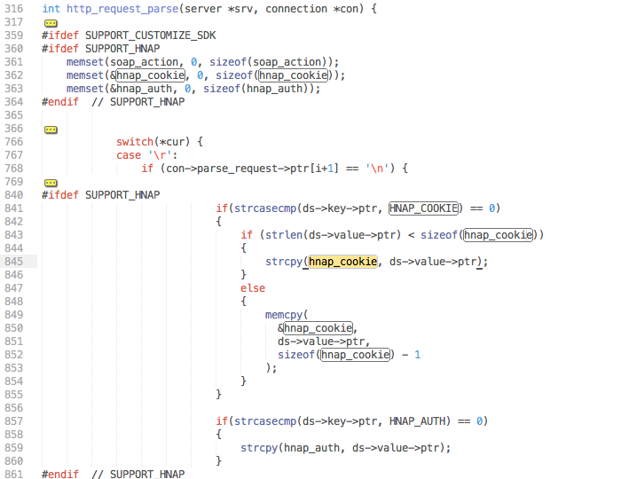

## D-Link DSP-W110 - multiple vulnerabilities

##### Discovered by:
* Peter Adkins &lt;peter.adkins@kernelpicnic.net&gt;

##### Access:
* Local network; unauthenticated access

##### Tracking and identifiers:
* CVE - None allocated.

##### Platforms / Firmware confirmed affected:
* D-Link DSP-W110 (Rev A) - v1.05b01

##### Notes:
* There appears to be a number of references to both 'miiiCasa' as well as 'fitivision' throughout the firmware, which may indicate that these vulnerabilities could be present in other devices not listed in this document.

### Arbitrary command execution / SQL Injection

Patches made to `lighttpd` by the vendor exposes the device to both SQL injection, and more interestingly, arbitrary code execution. This is due to the improper sanitization of data supplied by a client.

As the `lighttpd` service provides endpoints to be accessed without authentication, it provides a vector for an attacker to execute arbitrary commands on the device as the root user via HTTP call without authentication credentials.

The root cause of this issue is that the contents of an HTTP Cookie, with any name, is passed verbatim to a `sprintf()` call in order to form an SQL query used to validate existing client sessions. By simply performing an HTTP request against the device with a correctly formatted cookie set, arbitrary SQL can be executed against the internal SQLite database.

Further to this issue, as this SQL query is passed to a `popen()` call in order to execute the query, arbitrary commands are also able to be run on the device as the root user.

This said, due to the length of the allocated buffer, the value of the cookie cannot exceed 19 characters. However, as below, 19 characters is exactly enough to pop a shell on the device.

```bash
# Reboot the device.
curl \
 --cookie "terribleness='\`reboot\`" \
 192.168.1.3

# Spawn a root shell (telnet)
curl \
 --cookie "terribleness=\`telnetd -l/bin/sh\`" \
 192.168.1.3
```

###  Arbitrary file upload

Patches made to `lighttpd` by the vendor exposes the device to arbitrary file upload attacks.

Unfortunately, the only 'filtering' on this resources appears to be a `sprintf()` call which statically prefixes a submitted 'dev' argument with '/www'. However, if a HTTP request is performed without a 'dev' argument at all, the `sprintf()` call is never reached, and a fully-qualified path can be provided in the 'path' parameter - bypassing the upload path restriction.

As a result of the above, this resource can be used to upload files to any location on the filesystem of devices running vulnerable firmware versions without authentication.

```bash
# Upload arbitrary files to the device.
echo 'Some String' > test.txt
curl \
 -X POST \
 -i \
 -F name=@test.txt \
 --http1.0 \
 '192.168.1.3/web_cgi.cgi?&request=UploadFile&path=/etc/'
```

### Diagnostic Information

Patches made to `lighttpd` by the vendor of this device allows an attacker to query the device, without authentication, for the following information:

 * Current WLAN SSIDs
 * Current WLAN channels
 * LAN and WAN MAC addressing
 * Current firmware version information
 * Hardware version information

Although not sensitive information, it may allow for identification of devices running vulnerable firmware versions.

```bash
# Information query.
curl \
 192.168.1.3/mplist.txt
```

### Analysis :: Arbitrary command injection

There's really nothing much to say here, the reason this vulnerability exists is trivial.

While processing the HTTP headers for an incoming request, the patched `lighttpd` copies any cookies found in the request into `hnap_cookie` inside of `request.c` (line 845).



These cookies are then processed inside of `mod_hnap.c` where the value is parsed out (line 30) of the string.


This value is then munged into an SQL query via `sprintf()` (line 56), and thrown at `popen()` (line 64).


This is almost a text-book example of exactly how not to handle handle user input, especially considering that it is both an SQL query, AND a command passed to a root shell. In fact, this _IS_ a text-book example of how not to do things.

As a result of this lack of sanitization, a root shell can be popped, and the configuration database snatched, all through a couple of HTTP calls.

